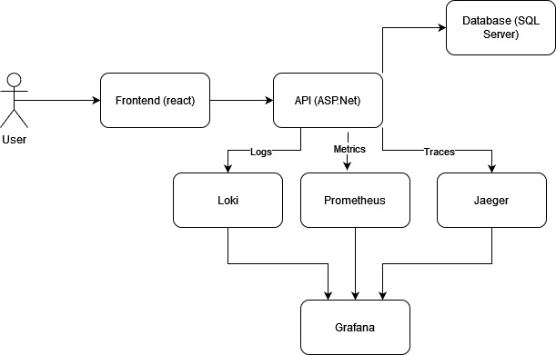
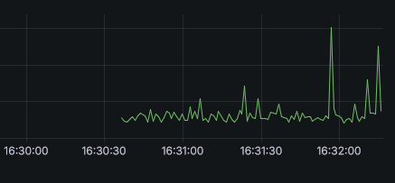
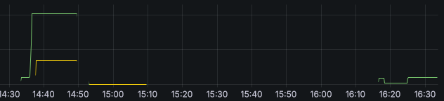

# AS_Solo_Proj1
## Autor: Pompeu Costa

### Arquitetura
A figura abaixo mostra a arquitetura da aplicação.

Como o grafana não consegue ler diretamente da API, foi usado o jaeger, no entando pode ser usado outra API.



### OpenTelemetry
#### Integração
O OpenTelemetry é usado para exportar metricas,traces e logs. Esta integração é feita no Program.cs

Abaixo apresentam-se excertos de código com a integração de logs,metrics e traces
#### Logs

Os logs por default estão a ser mandados para o [loki](https://github.com/grafana/loki)
```csharp
builder.Logging.AddOpenTelemetry(x =>
{
    x.SetResourceBuilder(ResourceBuilder.CreateDefault().AddService(serviceName))
    .AddOtlpExporter(options =>
    {
        options.Endpoint = new Uri(builder.Configuration.GetValue("Logs:Endpoint","http://localhost:3100")!);
    });
});
```

#### Metrics e Traces

As métricas por default são enviadas para o [prometheus](https://prometheus.io/).

As traces são enviadas em formato otlp. Grafana não consegue ler diretamente da API por isso foi usado o [jaeger](https://www.jaegertracing.io/) para visualizar traces no grafana, no entanto, é possível usar qualquer outra API.
```csharp
builder.Services.AddOpenTelemetry()
    .WithMetrics(x =>
    {
        x.AddRuntimeInstrumentation()
        .AddPrometheusExporter()
        .AddMeter(meterName);
    })
    .WithTracing(x =>
    {
        x.AddSource(serviceName)
        .ConfigureResource(resource => resource.AddService(serviceName, serviceVersion: serviceVersion))
        .AddAspNetCoreInstrumentation()
        .AddHttpClientInstrumentation()
        .AddOtlpExporter();
    });
```
#### Métricas Usadas
Existem duas métricas: logins feitos com sucesso e logins falhados.
```csharp
_meter = new Meter(meterName);
_successfulLoginsCounter = _meter.CreateCounter<long>("successful_logins");
_failedLoginsCounter = _meter.CreateCounter<long>("failed_logins");
```
Estas métricas são atualizadas no endpoint *login*
```csharp
if (result.Succeeded)
{
    logger.LogInformation($"User with email {loginModel.Email} logged in");
    _successfulLoginsCounter.Add(1);
    return Results.Ok(new { Message = "Login successful" });
}
else
{
    logger.LogInformation($"User with email {loginModel.Email} failed to logged in");
    _failedLoginsCounter.Add(1);
    return Results.BadRequest(new { Message = "Login failed" });
}
```
Também é possível ver, no excerto de código, o logging a ser feito neste endpoint

#### Traces
Traces são feitos nos endpoints *details* e *edit* com apenas uma linha, usando a class ActivitySource.
```csharp
using var myActivity = MyActivitySource.StartActivity("Get Client details");
```
```csharp
using var myActivity = MyActivitySource.StartActivity("Edit Client details");
```

#### Grafana
Para visualizar os dados mencionados acima, foi usado o grafana.

Exemplo de trace:



Exemplo de métricas, linha verde corresponde a logins falhados e linha amarela corresponde a logins com sucesso:



